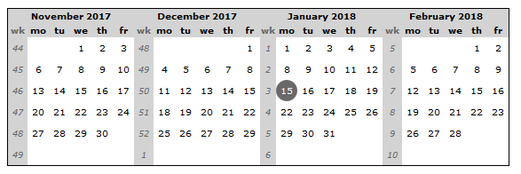

https://www.code-inspector.com/project/24169/score/svg

# jsMontlyCal

jsMonthlyCal is a javascript library to draw monthly calendar. It is a static calendar as there a no way to change month from browser.

## Screenshots



## Usage

```html
<!DOCTYPE html>
<html>
<head>
	<script src='./jsmonthlycal.js'></script>
	<script>
		window.onload = function() {
			var mydate = new Date();
			var options = {
				size: '10px',
				week: {
					color: 'DimGray'
				}
			};
			jsMonthlyCal.drawCalendar('here_calendar', mydate, 4, -2 , options);
		};
	</script>
</head>
<body>
<h2>Calendar</h2>
	<div>
		<table id="here_calendar" style="border: 1px solid; border-collapse: collapse;"></table>
	</div>
</body>
</html>
```

## API reference

* JScalendar.drawCalendar(container, date, nbtotal, nb, options)
   * container {string} div container id
   * date {date}
   * nbtotal {number} number of month to draw
   * nb {number} number of month after (positive) or before (negative)
   * options {object} all options to cutomize (CSS based language)

## Dependencies

* none

